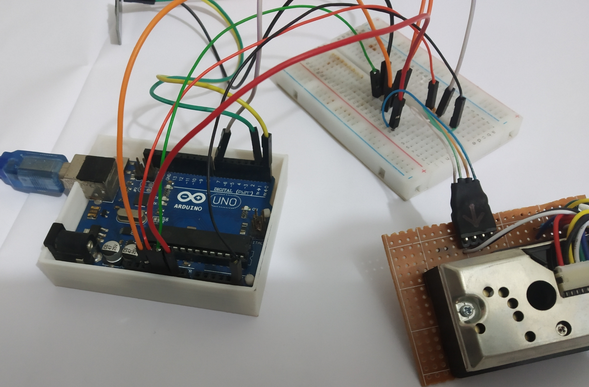
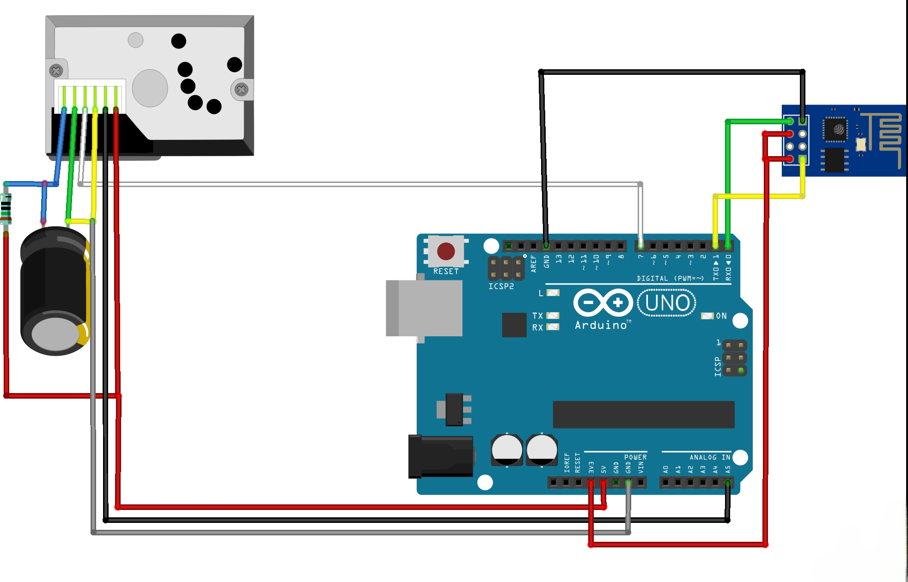
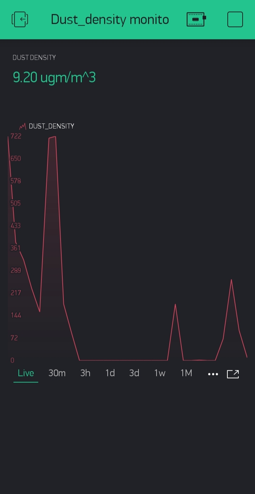

# 🌫️ Smart Air Quality Monitoring System — Arduino-Based PM Sensor

## 📖 Overview
This project presents the design and implementation of a **low-cost, Arduino-based dust sensor** for real-time measurement of **particulate matter (PM)** in the air.  
The system integrates **sensor data acquisition, logging, and visualization** to enable accessible environmental monitoring for urban and rural applications.

Key features:
- **Real-time PM measurement** using a dust sensor module
- **Arduino microcontroller** for data acquisition and processing
- **Data logging** for historical analysis
- **Visualization** of air quality trends using MATLAB
- **Low-cost, scalable design** for community deployment

---

## 🛠 Skills & Tools
- **Embedded Systems:** Arduino programming, sensor integration
- **Data Processing:** MATLAB, CSV logging
- **Electronics:** Circuit design, prototyping
- **Project Management:** Research, documentation, presentation

---

## 📄 Documentation
- [Poster Presentation](docs/dust_sensor_poster.pdf)
- [Arduino Code](code/dust_code.txt)

---

## 📸 Gallery
  
*Prototype circuit layout for the dust sensor system.*

  
*Sample output showing particulate matter readings over time.*

---

## 🔬 Design Highlights
1. **Sensor Integration** — Compact, modular design with easy sensor replacement.
2. **Data Logging** — Stores PM readings for later analysis.
3. **Visualization** — MATLAB scripts for plotting air quality trends.
4. **Low-Cost Build** — Affordable components for scalable deployment.

---

## 🚀 Potential Applications
- Urban air quality monitoring
- Industrial environment safety checks
- Educational projects on environmental science
- IoT-based smart city systems

---
